# 音声文字起こしシステム: アーキテクチャドキュメント

## 目次

1. [システム概要](#システム概要)
2. [アーキテクチャ図](#アーキテクチャ図)
3. [パイプライン詳細](#パイプライン詳細)
4. [技術仕様](#技術仕様)
5. [トラブルシューティング](#トラブルシューティング)

---

## システム概要

音声ファイルから高度な意味検索が可能な構造化データを生成し、クラウド連携とファイル管理を自動化する、多段階パイプラインシステム。

### 全体フロー

```
【入力層】
Google Drive / iCloud Drive / ローカル音声ファイル
    ↓
[監視・検知] webhook_server.py / icloud_monitor.py
    ↓ 自動検知・ダウンロード
    ↓
[Phase 1] 文字起こし (structured_transcribe.py)
    ↓ _structured.json (Speaker 1/2, segments, timestamps, Gemini Audio API)
    ↓
[Phase 2] 話者推論 (infer_speakers.py)
    ↓ _structured_with_speakers.json (Sugimoto/Other, confidence)
    ↓
[Phase 3] トピック・エンティティ抽出 (add_topics_entities.py)
    ↓ _enhanced.json (topics, entities)
    ↓
[Phase 4] エンティティ統一 (entity_resolution_llm.py)
    ↓ _enhanced.json updated (canonical_name, entity_id)
    ↓
[Phase 5] 統合Vector DB構築 (build_unified_vector_index.py)
    ↓ ChromaDB: transcripts_unified (複数ファイル統合)
    ↓
[Phase 6] 検索・RAG (semantic_search.py / rag_qa.py)
    → セマンティック検索 / Q&A回答生成
    ↓
[Phase 10] ファイル管理・クラウド同期
    ├─ Phase 10-1: 自動リネーム (generate_smart_filename.py)
    ├─ Phase 10-2: クラウド削除 (cloud_file_manager.py)
    └─ Phase 10-3: 統合レジストリ (unified_registry.py)
```

### 主要な技術的特徴

1. **多層パイプライン構造**: 6つの独立したフェーズで段階的に情報を付加
2. **クラウド統合**: Google Drive + iCloud Driveの自動監視・重複検知
3. **API Tier切り替え**: FREE/PAID tierを環境変数で切り替え可能
4. **統合Vector DB**: 複数ファイルを1つのコレクションに統合（クエリ数80%削減）
5. **エンティティ統一**: canonical_nameとentity_idで全ファイル横断の一意性を保証
6. **自動ファイル管理**: スマートリネーム、クラウド削除、レジストリ管理
7. **レート制限対応**: 各APIの制限に応じた待機処理実装
8. **エラーハンドリング**: JSON修復、フォールバック処理

---

## アーキテクチャ図

### システム全体図

```mermaid
graph TB
    subgraph "入力層 (Input Layer)"
        A[音声ファイル<br/>m4a/wav/mp3] --> B[structured_transcribe.py]
    end

    subgraph "文字起こし層 (Transcription Layer)"
        B --> |Gemini 2.5 Flash<br/>Audio API| C[_structured.json<br/>話者: Speaker 1/2<br/>セグメント<br/>タイムスタンプ]
    end

    subgraph "話者推論層 (Speaker Inference Layer)"
        C --> D[infer_speakers.py]
        D --> |Gemini 2.5 Pro<br/>LLM推論| E[_structured_with_speakers.json<br/>話者: Sugimoto/Other<br/>confidence評価]
    end

    subgraph "トピック・エンティティ抽出層 (Topic & Entity Extraction Layer)"
        E --> F[add_topics_entities.py]
        F --> |Gemini 2.0 Flash| G[_enhanced.json<br/>トピック分類<br/>エンティティ抽出<br/>people/orgs/dates]
    end

    subgraph "エンティティ統一層 (Entity Resolution Layer)"
        G --> H[entity_resolution_llm.py]
        H --> |Gemini 2.5 Pro<br/>名寄せ処理| I[_enhanced.json<br/>updated<br/>canonical_name<br/>entity_id付与]
    end

    subgraph "ベクトルDB構築層 (Vector DB Layer)"
        I --> J[build_unified_vector_index.py]
        J --> |Gemini Embeddings<br/>text-embedding-004| K[(ChromaDB<br/>transcripts_unified<br/>6,551セグメント<br/>5ファイル統合)]
    end

    subgraph "検索・RAG層 (Search & RAG Layer)"
        K --> L[semantic_search.py]
        K --> M[rag_qa.py]

        L --> |セマンティック検索| N[検索結果<br/>類似度スコア<br/>メタデータ付き]

        M --> |RAG検索| O[コンテキスト取得]
        O --> |Gemini 2.0 Flash| P[回答生成<br/>引用元付き]
    end

    subgraph "統合パイプライン (Orchestration)"
        Q[run_full_pipeline.py] -.-> B
        Q -.-> D
        Q -.-> F
    end

    subgraph "外部API (External APIs)"
        R[Google Gemini API<br/>FREE/PAID Tier選択]
        R --> |2.5 Flash| B
        R --> |2.5 Pro| D
        R --> |2.0 Flash| F
        R --> |2.5 Pro| H
        R --> |Embeddings API| J
        R --> |2.0 Flash| M
    end

    style A fill:#e1f5ff
    style C fill:#fff3cd
    style E fill:#d4edda
    style G fill:#d1ecf1
    style I fill:#d1ecf1
    style K fill:#f8d7da
    style N fill:#e2e3e5
    style P fill:#d4edda
    style R fill:#ffeaa7
```



### データフロー詳細図

```mermaid
flowchart LR
    subgraph "Phase 1: 文字起こし"
        A1[音声ファイル] --> A2{ファイルサイズ}
        A2 -->|20MB以下| A3[Gemini Audio API<br/>一括処理]
        A2 -->|20MB超過| A4[ffmpeg分割<br/>10分チャンク]
        A4 --> A5[チャンクごと処理<br/>30秒待機]
        A3 --> A6[_structured.json<br/>Speaker 1/2<br/>segments<br/>timestamp]
        A5 --> A6
    end

    subgraph "Phase 2: 話者推論"
        A6 --> B1[会話サンプル抽出<br/>最初50セグメント]
        B1 --> B2[プロフィール照合<br/>杉本プロフィール<br/>職務経歴書ベース]
        B2 --> B3[LLM判定<br/>Gemini 2.5 Pro]
        B3 --> B4[_with_speakers.json<br/>Sugimoto/Other<br/>confidence<br/>reasoning]
    end

    subgraph "Phase 3: トピック抽出"
        B4 --> C1[全文分析<br/>Gemini 2.0 Flash]
        C1 --> C2[トピック抽出<br/>id, name, keywords]
        C1 --> C3[エンティティ抽出<br/>people/orgs/dates]
        C2 --> C4[セグメント割当<br/>キーワードマッチ]
        C3 --> C5[_enhanced.json<br/>topics<br/>entities]
        C4 --> C5
    end

    subgraph "Phase 4: エンティティ統一"
        C5 --> D1[複数ファイル統合<br/>人物・組織収集]
        D1 --> D2[文脈付きリスト<br/>出現回数<br/>文脈例3つ]
        D2 --> D3[LLM名寄せ<br/>Gemini 2.5 Pro]
        D3 --> D4[canonical_name<br/>entity_id付与]
        D4 --> D5[_enhanced.json更新<br/>統一ID管理]
    end

    subgraph "Phase 5: Vector DB構築"
        D5 --> E1[セグメント統合<br/>5ファイル→6,551]
        E1 --> E2[メタデータ拡張<br/>source_file<br/>entity_id<br/>topics]
        E2 --> E3[Embeddings生成<br/>text-embedding-004<br/>バッチ100件]
        E3 --> E4[(ChromaDB<br/>transcripts_unified)]
    end

    subgraph "Phase 6: 検索・RAG"
        E4 --> F1[semantic_search.py<br/>クエリベクトル化]
        F1 --> F2[類似度検索<br/>Top-K取得]

        E4 --> G1[rag_qa.py<br/>コンテキスト検索]
        G1 --> G2[プロンプト構築<br/>セグメント引用]
        G2 --> G3[Gemini 2.0 Flash<br/>回答生成]
    end
```



### コンポーネント構成図

```mermaid
graph TB
    subgraph "実行スクリプト (Execution Scripts)"
        S1[structured_transcribe.py<br/>517行<br/>Gemini Audio API]
        S2[infer_speakers.py<br/>239行<br/>LLM話者推論]
        S3[add_topics_entities.py<br/>233行<br/>トピック抽出]
        S4[entity_resolution_llm.py<br/>580行<br/>エンティティ名寄せ]
        S5[build_unified_vector_index.py<br/>336行<br/>統合Vector DB]
        S6[semantic_search.py<br/>334行<br/>検索エンジン]
        S7[rag_qa.py<br/>351行<br/>RAG Q&A]
        S8[run_full_pipeline.py<br/>76行<br/>オーケストレーション]
    end

    subgraph "データストア (Data Stores)"
        D1[(ChromaDB<br/>chroma_db/<br/>PersistentClient)]
        D2[(_structured.json<br/>音声文字起こし)]
        D3[(_with_speakers.json<br/>話者特定済み)]
        D4[(_enhanced.json<br/>トピック・エンティティ)]
    end

    subgraph "外部API (External APIs)"
        API1[Gemini 2.5 Flash<br/>文字起こし]
        API2[Gemini 2.5 Pro<br/>推論・名寄せ]
        API3[Gemini 2.0 Flash<br/>抽出・回答]
        API4[Gemini Embeddings<br/>text-embedding-004]
    end

    subgraph "設定・環境 (Configuration)"
        ENV[.env<br/>GEMINI_API_KEY_FREE<br/>GEMINI_API_KEY_PAID<br/>USE_PAID_TIER]
        CFG[requirements.txt<br/>google-generativeai<br/>chromadb<br/>python-dotenv]
    end

    S1 --> API1
    S1 --> D2

    S2 --> API2
    S2 --> D2
    S2 --> D3

    S3 --> API3
    S3 --> D3
    S3 --> D4

    S4 --> API2
    S4 --> D4

    S5 --> API4
    S5 --> D4
    S5 --> D1

    S6 --> API4
    S6 --> D1

    S7 --> API4
    S7 --> API3
    S7 --> D1

    S8 -.-> S2
    S8 -.-> S3

    ENV --> S1
    ENV --> S2
    ENV --> S3
    ENV --> S4
    ENV --> S5
    ENV --> S6
    ENV --> S7

    style D1 fill:#f8d7da
    style D2 fill:#fff3cd
    style D3 fill:#d4edda
    style D4 fill:#d1ecf1
    style ENV fill:#ffeaa7
```



### API呼び出しフロー & レート制限

```mermaid
sequenceDiagram
    participant User
    participant Script
    participant Gemini_API
    participant ChromaDB

    Note over User,ChromaDB: Phase 1: 文字起こし (structured_transcribe.py)
    User->>Script: 音声ファイル
    Script->>Script: ファイルサイズチェック
    alt 20MB以下
        Script->>Gemini_API: Audio API (2.5 Flash)
        Gemini_API-->>Script: JSON (segments, speakers)
    else 20MB超過
        loop 各チャンク
            Script->>Gemini_API: Audio API (chunk)
            Note right of Script: 30秒待機 (2 RPM制限)
            Gemini_API-->>Script: JSON (segments)
        end
    end
    Script->>Script: _structured.json保存

    Note over User,ChromaDB: Phase 2: 話者推論 (infer_speakers.py)
    Script->>Script: 最初50セグメント抽出
    Script->>Gemini_API: LLM推論 (2.5 Pro)<br/>temperature=0.1
    Gemini_API-->>Script: {sugimoto_speaker, confidence, reasoning}
    Script->>Script: Speaker 1/2 → Sugimoto/Other
    Script->>Script: _with_speakers.json保存

    Note over User,ChromaDB: Phase 3: トピック抽出 (add_topics_entities.py)
    Script->>Gemini_API: トピック・エンティティ抽出<br/>(2.0 Flash)
    Gemini_API-->>Script: {topics[], entities{}}
    Script->>Script: セグメントにトピック割当
    Script->>Script: _enhanced.json保存

    Note over User,ChromaDB: Phase 4: エンティティ名寄せ (entity_resolution_llm.py)
    Script->>Script: 5ファイル統合<br/>人物・組織リスト作成
    Script->>Gemini_API: 人物名寄せ (2.5 Pro)
    Gemini_API-->>Script: {people_groups[], separate_entities[]}
    Script->>Gemini_API: 組織名寄せ (2.5 Pro)
    Gemini_API-->>Script: {org_groups[], separate_entities[]}
    Script->>Script: canonical_name + entity_id付与
    Script->>Script: _enhanced.json更新

    Note over User,ChromaDB: Phase 5: Vector DB構築 (build_unified_vector_index.py)
    Script->>Script: 6,551セグメント準備
    loop バッチ (100件ずつ)
        Script->>Gemini_API: Embeddings API<br/>(text-embedding-004)
        Note right of Script: 2秒待機 (FREE tier: 1.04 req/min)
        Gemini_API-->>Script: embeddings[]
        Script->>ChromaDB: add(documents, embeddings, metadatas)
    end
    ChromaDB-->>Script: collection.count()

    Note over User,ChromaDB: Phase 6: 検索 (semantic_search.py / rag_qa.py)
    User->>Script: クエリ
    Script->>Gemini_API: Embeddings API (query)
    Gemini_API-->>Script: query_embedding
    Script->>ChromaDB: query(query_embedding, n_results=5)
    ChromaDB-->>Script: {documents[], metadatas[], distances[]}

    alt RAGモード
        Script->>Gemini_API: 回答生成 (2.0 Flash)<br/>context + query
        Gemini_API-->>Script: answer + citations
    end

    Script-->>User: 検索結果 or 回答
```



---

## パイプライン詳細

### Phase 1: 文字起こし (`structured_transcribe.py`)

**目的**: 音声ファイルをGemini Audio APIで文字起こし

**処理内容**:
- ファイルサイズチェック（20MB制限）
- 20MB超過時はffmpegで10分チャンクに分割
- Gemini 2.5 Flash Audio APIで話者識別付き文字起こし
- JSON形式で構造化データ出力

**入力**: 音声ファイル (m4a/wav/mp3)
**出力**: `*_structured.json`

**主要機能**:
```python
# ファイルサイズチェック
MAX_FILE_SIZE = 20 * 1024 * 1024  # 20MB

# チャンク処理（20MB超過時）
def split_audio_file(file_path, chunk_duration=600):
    # ffmpegで10分ごとに分割
    ...

# Gemini Audio API呼び出し
model = genai.GenerativeModel("gemini-2.5-flash")
response = model.generate_content(
    [prompt, {"mime_type": mime_type, "data": audio_bytes}],
    generation_config={"response_mime_type": "application/json"}
)
```

**出力JSON構造**:
```json
{
  "metadata": {
    "file": {
      "file_name": "recording.m4a",
      "duration_seconds": 1800.0
    },
    "transcription": {
      "language": "ja",
      "segment_count": 145
    }
  },
  "segments": [
    {
      "id": 1,
      "speaker": "Speaker 1",
      "text": "発言内容",
      "timestamp": "01:23"
    }
  ],
  "full_text": "全文テキスト",
  "summary": "要約"
}
```

**実行例**:
```bash
python structured_transcribe.py "audio/recording.m4a"
```

**所要時間**: 10分音声で約5-10秒（API応答時間による）

---

### Phase 2: 話者推論 (`infer_speakers.py`)

**目的**: 会話から話者を特定し、Sugimoto/Otherに分類

**処理内容**:
- 会話内容とプロフィールから話者を推論（Gemini 2.5 Pro）
- 判断基準:
  1. 名前の明示的言及
  2. 録音者の可能性（独白、思考整理）
  3. 会話の主導者（専門的話題を深く語る）
  4. 質問を受ける側（面談、キャリアを語る）
  5. 意思決定者の立場

**入力**: `*_structured.json`
**出力**: `*_structured_with_speakers.json`

**メタデータ追加**:
```json
{
  "speaker_inference": {
    "inferred_at": "2025-10-12T19:28:46.819958",
    "result": {
      "sugimoto_identified": true,
      "sugimoto_speaker": "Speaker 2",
      "confidence": "high",
      "reasoning": "..."
    },
    "sugimoto_segments": 351,
    "other_segments": 362
  }
}
```

**実行例**:
```bash
python infer_speakers.py "downloads/recording_structured.json"
```

**所要時間**: 約5秒

---

### Phase 3: トピック・エンティティ抽出 (`add_topics_entities.py`)

**目的**: 全文からトピック・エンティティを自動抽出してセグメントに割り当て

**処理内容**:
- Gemini 2.0 Flashで全文分析
- トピック抽出（id, name, summary, keywords）
- エンティティ抽出（people, organizations, dates, action_items）
- キーワードマッチングでセグメントにトピック割り当て

**入力**: `*_structured_with_speakers.json`
**出力**: `*_enhanced.json`

**主要機能**:
```python
# トピック・エンティティ抽出
def extract_topics_and_entities(full_text):
    model = genai.GenerativeModel("gemini-2.0-flash-exp")
    # JSON形式で出力
    prompt = """以下のJSON形式で出力:
    {
      "topics": [{"id": "topic_1", "name": "...", "keywords": [...]}],
      "entities": {"people": [...], "organizations": [...], ...}
    }"""
    ...

# セグメントにトピック割り当て
def assign_topics_to_segments(segments, topics):
    # キーワードマッチング
    for topic in topics:
        if any(keyword in seg_text for keyword in keywords):
            assigned_topics.append(topic["id"])
    ...
```

**出力JSON構造**:
```json
{
  "topics": [
    {
      "id": "topic_1",
      "name": "起業準備",
      "summary": "起業に向けた準備について",
      "keywords": ["起業", "資金調達", "ビジネスモデル"]
    }
  ],
  "entities": {
    "people": ["杉本", "福島"],
    "organizations": ["リクルート", "エクサウィザーズ"],
    "dates": ["2025年1月"],
    "action_items": ["事業計画を作成する"]
  },
  "segments": [
    {
      "id": 1,
      "speaker": "Sugimoto",
      "text": "...",
      "topics": ["topic_1", "topic_3"]
    }
  ]
}
```

**実行例**:
```bash
python add_topics_entities.py "downloads/recording_structured_with_speakers.json"
```

**所要時間**: 約5-10秒

---

### Phase 4: エンティティ統一 (`entity_resolution_llm.py`)

**目的**: 複数ファイル横断でエンティティを名寄せし、統一ID付与

**処理内容**:
- 5ファイルから人物・組織エンティティを収集
- 文脈付きリスト作成（出現回数、文脈例3つ）
- Gemini 2.5 Proで名寄せ判定
- canonical_name + entity_id付与
- 全`_enhanced.json`を更新

**入力**: 複数の`*_enhanced.json`
**出力**: 更新された`*_enhanced.json` + `entity_resolution_report.md`

**主要機能**:
```python
class EntityResolver:
    def resolve_people_with_llm(self, people):
        # LLMで同一人物判定
        prompt = """同一人物と思われるものをグループ化:
        - 敬称の有無は無視（「福島さん」「福島」）
        - 文脈から同一人物か判断
        出力: {people_groups: [...], separate_entities: [...]}
        """
        ...

    def update_enhanced_json(self, json_files, people_result, org_result):
        # canonical_name + entity_idマッピング作成
        people_mapping = {
            variant: {
                'canonical_name': canonical_name,
                'entity_id': f"person_{i:03d}"
            }
        }
        # 全ファイル更新
        ...
```

**名寄せ結果例**:
```json
{
  "people_groups": [
    {
      "canonical_name": "福島",
      "variants": ["福島さん", "福島"],
      "entity_ids": [1, 3],
      "confidence": "high",
      "reason": "敬称の有無のみ異なる同一人物"
    }
  ]
}
```

**更新後のエンティティ**:
```json
{
  "entities": {
    "people": [
      {
        "name": "福島さん",
        "canonical_name": "福島",
        "entity_id": "person_001",
        "variants": ["福島さん", "福島"]
      }
    ],
    "organizations": [
      {
        "name": "リクルート",
        "canonical_name": "リクルートホールディングス",
        "entity_id": "org_001",
        "variants": ["リクルート", "リクルートホールディングス"]
      }
    ]
  }
}
```

**実行例**:
```bash
python entity_resolution_llm.py downloads/*_enhanced.json
```

**所要時間**: 約10-15秒（5ファイル、60エンティティ）

---

### Phase 5: 統合Vector DB構築 (`build_unified_vector_index.py`)

**目的**: 複数ファイルを1つのChromaDBコレクションに統合

**処理内容**:
- 5ファイルから6,551セグメントを統合
- メタデータ拡張（source_file, entity_id, topics）
- Gemini Embeddings APIでベクトル化（バッチ100件）
- ChromaDB `transcripts_unified`コレクションに保存

**入力**: 複数の`*_enhanced.json`
**出力**: ChromaDB `transcripts_unified` (6,551 documents)

**主要機能**:
```python
class UnifiedVectorIndexBuilder:
    def prepare_unified_documents(self, json_files):
        # 全ファイルからセグメント収集
        for segment in segments:
            metadata = {
                'segment_id': str(segment_id),
                'source_file': source_file,  # ファイル横断追跡
                'speaker': segment['speaker'],
                'segment_topics': ', '.join(topic_names),
                'people': ', '.join(f"{canonical}({entity_id})"),
                'organizations': ', '.join(f"{canonical}({entity_id})")
            }
            all_metadatas.append(metadata)
        ...

    def build_unified_index(self, texts, metadatas, ids):
        # バッチ処理（100件ずつ）
        for i in range(0, len(texts), 100):
            # Gemini Embeddings API
            result = genai.embed_content(
                model="models/text-embedding-004",
                content=batch_texts,
                task_type="retrieval_document"
            )
            # ChromaDBに保存
            collection.add(
                documents=batch_texts,
                embeddings=batch_embeddings,
                metadatas=batch_metadatas
            )
            time.sleep(2)  # レート制限対策
        ...
```

**メタデータ構造**:
```json
{
  "segment_id": "1",
  "source_file": "09-22 杉本ミーティング.m4a",
  "speaker": "Sugimoto",
  "timestamp": "01:23",
  "segment_topics": "起業準備, 資金調達",
  "global_topics": "起業準備, 医療流通プラットフォーム",
  "people": "杉本(person_001), 福島(person_002)",
  "organizations": "リクルートホールディングス(org_001)"
}
```

**実行例**:
```bash
python build_unified_vector_index.py downloads/*_enhanced.json
```

**所要時間**: 約2-3分（6,551セグメント、66バッチ）

---

### Phase 6: 検索・RAG (`semantic_search.py` / `rag_qa.py`)

#### セマンティック検索 (`semantic_search.py`)

**目的**: 自然言語クエリで関連セグメントを検索

**処理内容**:
- クエリをGemini Embeddings APIでベクトル化
- ChromaDB `transcripts_unified`で類似度検索
- Top-K結果を類似度スコア付きで返却

**主要機能**:
```python
class SemanticSearchEngine:
    def search(self, query, collection_name="transcripts_unified", n_results=5):
        # クエリベクトル化
        result = genai.embed_content(
            model="models/text-embedding-004",
            content=query,
            task_type="retrieval_query"
        )
        query_embedding = result['embedding']

        # ChromaDB検索
        results = collection.query(
            query_embeddings=[query_embedding],
            n_results=n_results
        )

        # 類似度スコア計算
        similarity_score = 1 / (1 + distance)
        ...
```

**実行例**:
```bash
# 基本検索
python semantic_search.py transcripts_unified

# インタラクティブモード
python semantic_search.py transcripts_unified --interactive
```

#### RAG Q&A (`rag_qa.py`)

**目的**: 質問に対して文字起こしデータを元に回答生成

**処理内容**:
- 質問からコンテキスト検索（Top-5）
- コンテキスト+質問でプロンプト構築
- Gemini 2.0 Flashで回答生成
- 引用元セグメント情報を付与

**主要機能**:
```python
class RAGQASystem:
    def ask(self, query, collection_name="transcripts_unified", n_contexts=5):
        # 1. コンテキスト検索
        contexts = self.retrieve_context(query, collection_name, n_contexts)

        # 2. プロンプト構築
        prompt = f"""以下の文字起こしデータを参照して質問に答えてください。
        【文字起こしコンテキスト】
        {context_text}

        【質問】
        {query}

        【回答】（必ず引用セグメント番号を明記）
        """

        # 3. 回答生成
        response = self.llm.generate_content(prompt)
        ...
```

**実行例**:
```bash
# サンプル質問デモ
python rag_qa.py transcripts_unified

# インタラクティブモード
python rag_qa.py transcripts_unified --interactive
```

**回答例**:
```
❓ Question: 起業準備について何を話していましたか？

💡 Answer:
起業準備については、主に以下の点が議論されていました：
- 資金調達の方法（[セグメント 1]）
- ビジネスモデルの検証（[セグメント 3]）
- 初期チームの構築（[セグメント 5]）

📚 Sources:
[セグメント 1] (類似度: 0.8923)
📂 ソース: 09-22 杉本ミーティング.m4a
🗣️ 話者: Sugimoto
⏱️ タイムスタンプ: 03:45
📝 内容: 資金調達については、まずエンジェル投資家から...
```

---

### Step 2: コンテキストプロンプト付き要約 (`summarize_with_context.py`) (非推奨)

**目的**: 話者情報を活用した高精度要約とトピック/エンティティ抽出

**処理内容**:
- System Instructionsで話者プロフィールを付与
- ウィンドウ単位（10セグメント）で要約
- 全文からトピック/エンティティを抽出（5カテゴリ）

**System Instructions**:
- Sugimotoの発言を重点的に要約（意思決定、戦略、アイデア）
- 専門用語を正確に扱う（起業、資金調達、医療、DX、AI）
- 具体的な数字、日付、固有名詞を保持

**入力**: `*_structured_with_speakers.json`
**出力**: `*_structured_summarized.json`

**メタデータ追加**:
```json
{
  "summarized_segments": [
    {
      "id": 1,
      "original_segment_ids": [1, 2, 3, ..., 10],
      "speaker": "Summary",
      "text": "要約テキスト",
      "timestamp": "01:21",
      "original_segments_count": 10
    },
    ...
  ],
  "topics_entities": {
    "topics": ["起業準備", "医療流通プラットフォーム", ...],
    "entities": {
      "people": ["杉本", ...],
      "organizations": ["スタートアップ", ...],
      "locations": ["東京", ...],
      "products_services": ["プラットフォーム", ...],
      "concepts": ["資金調達", "事業戦略", ...]
    }
  }
}
```

**実行例**:
```bash
python summarize_with_context.py "downloads/recording_structured_with_speakers.json"
```

**所要時間**:
- 713セグメント → 72回のAPI呼び出し
- 約36分（Gemini 2.5 Proのレート制限: 2 req/min）

---

### Step 3: 最適ファイル名生成 (`generate_optimal_filename.py`)

**目的**: 話者情報 + 要約 + トピック + エンティティを統合して最適なファイル名を生成

**処理内容**:
- 全情報を統合してLLMに最適化を依頼
- ファイル名要件:
  1. 日付を含める（元ファイル名から抽出）
  2. 会話の種類（面談、ミーティング、カジュアル会話など）
  3. 主要トピック2-3個
  4. 話者情報を活用
  5. 全体で50-80文字程度
  6. 検索しやすく内容が一目でわかる

**入力**: `*_structured_summarized.json`
**出力**: `*_structured_final.json`

**メタデータ追加**:
```json
{
  "optimal_filename": {
    "generated_at": "2025-10-12T19:45:00.000000",
    "filename": "09-22 意思決定ミーティング：Sugimoto-起業準備と医療流通プラットフォーム戦略の統合検討",
    "reasoning": "..."
  }
}
```

**実行例**:
```bash
python generate_optimal_filename.py "downloads/recording_structured_summarized.json"
```

**所要時間**: 約5秒

---

## 統合パイプライン実行

### 自動実行（推奨）

```bash
python run_full_pipeline.py "downloads/recording_structured.json"
```

3つのステップを自動で順次実行します。

### 手動実行

```bash
# Step 1
python infer_speakers.py "downloads/recording_structured.json"

# Step 2
python summarize_with_context.py "downloads/recording_structured_with_speakers.json"

# Step 3
python generate_optimal_filename.py "downloads/recording_structured_summarized.json"
```

---

## 技術仕様

### 使用モデル一覧

| Phase | スクリプト | モデル | 用途 |
|-------|-----------|--------|------|
| Phase 1 | structured_transcribe.py | Gemini 2.5 Flash | 音声文字起こし + 話者識別 |
| Phase 2 | infer_speakers.py | Gemini 2.5 Pro | 話者推論（LLM判定） |
| Phase 3 | add_topics_entities.py | Gemini 2.0 Flash | トピック・エンティティ抽出 |
| Phase 4 | entity_resolution_llm.py | Gemini 2.5 Pro | エンティティ名寄せ |
| Phase 5 | build_unified_vector_index.py | text-embedding-004 | ベクトル化（768次元） |
| Phase 6 | semantic_search.py | text-embedding-004 | クエリベクトル化 |
| Phase 6 | rag_qa.py | Gemini 2.0 Flash + text-embedding-004 | RAG回答生成 |

### API Tier管理

**環境変数設定** (`.env`)
```bash
# FREE Tier (デフォルト)
GEMINI_API_KEY_FREE=your_free_api_key
USE_PAID_TIER=false

# PAID Tier（切り替え時）
GEMINI_API_KEY_PAID=your_paid_api_key
USE_PAID_TIER=true
```

**Tier選択ロジック** (全スクリプト共通)
```python
USE_PAID_TIER = os.getenv("USE_PAID_TIER", "false").lower() == "true"
if USE_PAID_TIER:
    GEMINI_API_KEY = os.getenv("GEMINI_API_KEY_PAID")
    print("ℹ️  Using PAID tier API key")
else:
    GEMINI_API_KEY = os.getenv("GEMINI_API_KEY_FREE")
    print("ℹ️  Using FREE tier API key")
```

### レート制限

| API | FREE Tier | PAID Tier | 実装対策 |
|-----|-----------|-----------|----------|
| Gemini 2.5 Flash (Audio) | 2 req/min | 制限緩和 | 30秒待機（チャンク処理時） |
| Gemini 2.5 Pro | 2 req/min | 制限緩和 | 単発呼び出しのみ |
| Gemini 2.0 Flash | 15 req/min | 制限緩和 | 単発呼び出しのみ |
| text-embedding-004 | 1500 req/day (1.04 req/min) | 制限緩和 | 2秒待機（バッチ処理） |

**実装例**:
```python
# Phase 1: チャンク処理時の待機
if i > 1:
    time.sleep(30)  # 2 RPM制限対応

# Phase 5: Embeddings API バッチ処理
for i in range(0, len(texts), 100):
    # ... API呼び出し ...
    if i + batch_size < len(texts):
        time.sleep(2)  # 1.04 req/min制限対応
```

### ファイルフォーマット

**JSON出力仕様**
- エンコーディング: UTF-8
- インデント: 2スペース
- ASCII変換: 無効化 (`ensure_ascii=False`)
- 日本語: そのまま保存

**例**:
```python
with open(output_path, "w", encoding="utf-8") as f:
    json.dump(data, f, ensure_ascii=False, indent=2)
```

### データサイズ実績

| 項目 | 値 |
|------|-----|
| 処理ファイル数 | 5ファイル |
| 総セグメント数 | 6,551セグメント |
| 統一人物エンティティ | 19名 → 統合後 |
| 統一組織エンティティ | 41組織 → 統合後 |
| Vector DB容量 | 6,551 documents (ChromaDB) |
| Embedding次元数 | 768次元 (text-embedding-004) |

### エラーハンドリング

#### 1. JSON修復機能

```python
# structured_transcribe.py
try:
    data = json.loads(response.text)
except json.JSONDecodeError as e:
    # 最後の完全なセグメントを見つける
    last_complete = text.rfind('},')
    if last_complete > 0:
        repaired = text[:last_complete + 1] + '\n  ]\n}'
        data = json.loads(repaired)
        print(f"✓ JSON repaired successfully.")
```

#### 2. API エラーハンドリング

```python
# Gemini API finish_reason チェック
if not response.text:
    print(f"⚠️ Gemini API response error: finish_reason={response.candidates[0].finish_reason}")
    raise ValueError(f"Gemini blocked response")
```

#### 3. フォールバック処理

```python
# build_unified_vector_index.py: バッチ失敗時の個別処理
except Exception as e:
    print(f"⚠️ Batch embedding failed: {e}")
    print(f"Falling back to individual calls...")
    # 1件ずつ処理
    for text in batch_texts:
        result = genai.embed_content(...)
```

### 依存関係

**requirements.txt**
```
google-generativeai>=0.8.0
chromadb>=0.4.0
python-dotenv>=1.0.0
```

**システム要件**
- Python 3.10+
- ffmpeg (音声分割用)
- macOS 14+ / Linux / Windows
- RAM: 8GB以上推奨
- ストレージ: 5GB以上（ChromaDB + モデルキャッシュ）

---

## 実装の特徴

### 1. 話者情報の活用
- Step 1で特定した話者情報を後続ステップで活用
- "Sugimotoの発言では..." のように明示的に話者を参照

### 2. コンテキスト強化
- System Instructionsで話者プロフィールを付与
- 専門用語や固有名詞の正確な理解

### 3. 情報の統合
- Step 3で全情報を統合して最適化
- 検索性と可読性を両立したファイル名

### 4. メタデータの保持
- 各ステップでメタデータを追加
- 処理履歴と結果をすべて記録

---

## Phase 10: ファイル管理・クラウド連携

### Phase 10-1: 自動ファイル名変更 (`generate_smart_filename.py`)

**目的**: 文字起こし内容に基づき、最適なファイル名を自動生成してリネーム

**処理内容**:
- Gemini 2.0 Flash APIで要約・全文から会話トピックを抽出
- 日本語対応のファイル名生成（macOS/Windows互換）
- YYYYMMDD形式の日付を自動付与
- 音声ファイル + 関連JSON等を一括リネーム
- Google Driveファイルは削除するため、ローカルのみリネーム

**入力**: `*_structured.json`
**出力**: リネームされた音声ファイル + JSON

**主要機能**:
```python
def generate_smart_filename_from_json(json_path):
    # JSONから要約・全文を抽出
    full_text = data.get("full_text", "")
    summary = data.get("summary", "")

    # Gemini APIで最適なファイル名生成
    prompt = """
    以下の文字起こしデータから、ファイル名を生成してください。
    要件:
    - 20-30文字以内
    - 日本語OK
    - 日付付与（YYYYMMDD）
    - 会話の核心を表現
    """

    # ファイル名の安全性チェック
    safe_filename = sanitize_filename(generated_name)

    # 音声ファイル + JSON を一括リネーム
    rename_audio_and_json(audio_path, safe_filename)
```

**リネーム例**:
```
変更前: temp_1a2b3c4d5e.m4a
変更後: 20251015_営業戦略ミーティング_Q4計画.m4a
```

**環境変数**:
```bash
AUTO_RENAME_FILES=true  # 有効化
GEMINI_API_KEY_FREE=your_api_key
```

**所要時間**: 約3-5秒

---

### Phase 10-2: クラウドファイル自動削除 (`cloud_file_manager.py`)

**目的**: 文字起こし完了後、Google Driveの音声ファイルを自動削除してストレージ節約

**処理内容**:
- JSON完全性の5項目検証（ファイル存在、サイズ、パース可能、segments、full_text、metadata）
- 検証合格後にGoogle Driveファイルを削除
- ローカルファイルは保持
- 削除イベントを`.deletion_log.jsonl`に記録
- 削除失敗時も処理続行（非致命的エラー）

**入力**: `*_structured.json` + Google Drive file_id
**出力**: 削除ログ (`.deletion_log.jsonl`)

**主要機能**:
```python
def validate_json_completeness(json_path):
    """5項目の完全性チェック"""
    checks = {
        'file_exists': os.path.exists(json_path),
        'file_size_bytes': os.path.getsize(json_path),
        'json_parsable': True,
        'has_segments': len(data.get('segments', [])) > 0,
        'has_full_text': len(data.get('full_text', '')) > 10,
        'has_metadata': 'metadata' in data
    }
    return all(checks.values()), checks

def delete_drive_file_if_valid(file_id, json_path):
    """検証合格後にGoogle Driveファイル削除"""
    is_valid, details = validate_json_completeness(json_path)

    if is_valid:
        # Google Drive API呼び出し
        drive_service.files().delete(fileId=file_id).execute()
        log_deletion(file_id, json_path, success=True)
    else:
        log_deletion(file_id, json_path, success=False, reason="Validation failed")
```

**削除ログ形式** (`.deletion_log.jsonl`):
```json
{
  "timestamp": "2025-10-15T07:31:46+00:00",
  "file_id": "1K5RZwauhMSb_jHdhkYaIPsA-6WbkQA41",
  "file_name": "recording.m4a",
  "json_path": "downloads/20251015_会議_structured.json",
  "validation_passed": true,
  "validation_details": {
    "segments_count": 33,
    "full_text_length": 530,
    "file_size_bytes": 9538
  },
  "deleted": true,
  "error": null
}
```

**所要時間**: 約1-2秒

---

### Phase 10-3: iCloud Drive統合 (`icloud_monitor.py` + `unified_registry.py`)

**目的**: iCloud Driveへの音声ファイル保存を自動検知し、Google Driveとの重複を防止

**処理内容**:
- watchdogライブラリでiCloud Driveをリアルタイム監視（FSEvents）
- SHA-256ハッシュで同一ファイルを検知（重複防止）
- 統合レジストリで Google Drive + iCloud Drive を一元管理
- ファイル安定待機（iCloud同期完了確認）
- file_id ↔ ファイル名マッピング（リネーム後も追跡可能）

**入力**: iCloud Drive音声ファイル (.m4a, .mp3, .wav等)
**出力**: 統合レジストリ (`.processed_files_registry.jsonl`)

**主要機能**:
```python
class ICloudMonitor:
    def __init__(self, icloud_path):
        self.observer = Observer()
        self.handler = AudioFileHandler()

    def on_created(self, event):
        """ファイル作成時のハンドラ"""
        # ファイル安定待機（iCloud同期完了）
        wait_for_file_stability(file_path, timeout=300)

        # SHA-256ハッシュ計算
        file_hash = calculate_sha256(file_path)

        # 重複チェック
        if registry.is_duplicate(file_hash):
            print(f"⚠️  Duplicate detected: {file_path}")
            return

        # 文字起こし実行
        structured_transcribe(file_path)

        # レジストリ登録
        registry.add_entry(
            source="icloud_drive",
            file_hash=file_hash,
            original_name=file_name,
            local_path=file_path
        )

class UnifiedRegistry:
    def is_duplicate(self, file_hash):
        """ハッシュベースの重複検知"""
        for entry in self.load_registry():
            if entry['hash'] == file_hash:
                return True
        return False

    def add_entry(self, source, file_hash, original_name, **kwargs):
        """統合レジストリに登録"""
        entry = {
            'source': source,  # 'google_drive' or 'icloud_drive'
            'file_id': kwargs.get('file_id', None),
            'hash': file_hash,
            'original_name': original_name,
            'renamed_to': kwargs.get('renamed_to', None),
            'local_path': kwargs.get('local_path', ''),
            'processed_at': datetime.now(timezone.utc).isoformat()
        }
        self.append_to_jsonl(entry)
```

**統合レジストリ形式** (`.processed_files_registry.jsonl`):
```jsonl
{"source":"google_drive","file_id":"16BNBa773...","hash":"a1b2c3d4...","original_name":"recording.m4a","renamed_to":"20251015_会議.m4a","local_path":"downloads/20251015_会議.m4a","processed_at":"2025-10-15T16:30:00Z"}
{"source":"icloud_drive","file_id":null,"hash":"e5f6g7h8...","original_name":"memo.m4a","renamed_to":"20251015_メモ.m4a","local_path":"~/Library/Mobile Documents/.../memo.m4a","processed_at":"2025-10-15T16:35:00Z"}
```

**重複検知の動作例**:
```
1. [13:00] Google Driveに手動アップロード
   → 文字起こし実行
   → ハッシュ "a1b2c3..." をレジストリ登録

2. [13:30] 同じファイルがiCloud Driveに同期
   → ハッシュ計算 → "a1b2c3..."
   → レジストリで重複検知
   → スキップ（二重処理防止）
```

**環境変数**:
```bash
ENABLE_ICLOUD_MONITORING=true
ICLOUD_DRIVE_PATH=~/Library/Mobile Documents/com~apple~CloudDocs
PROCESSED_FILES_REGISTRY=.processed_files_registry.jsonl
```

**実行例**:
```bash
# iCloud監視起動
python icloud_monitor.py

# Google Drive Webhookと併用
# ターミナル1
python webhook_server.py

# ターミナル2
python icloud_monitor.py
```

**所要時間**: リアルタイム監視（常駐プロセス）

---

## クラウド連携の全体フロー

```mermaid
graph TB
    subgraph "入力ソース"
        A1[Google Drive]
        A2[iCloud Drive]
        A3[ローカルファイル]
    end

    subgraph "監視・検知"
        B1[webhook_server.py<br/>Google Drive Webhook]
        B2[icloud_monitor.py<br/>watchdog FSEvents]
    end

    subgraph "重複チェック"
        C[unified_registry.py<br/>SHA-256ハッシュ]
    end

    subgraph "文字起こし"
        D[structured_transcribe.py<br/>Gemini Audio API]
    end

    subgraph "Phase 10: ファイル管理"
        E1[Phase 10-1<br/>generate_smart_filename.py<br/>自動リネーム]
        E2[Phase 10-2<br/>cloud_file_manager.py<br/>Google Drive削除]
        E3[Phase 10-3<br/>unified_registry.py<br/>レジストリ更新]
    end

    subgraph "Phase 2-6"
        F[話者推論→トピック抽出<br/>→Vector DB→検索]
    end

    A1 --> B1
    A2 --> B2
    A3 --> D

    B1 --> C
    B2 --> C

    C -->|重複なし| D
    C -->|重複あり| G[スキップ]

    D --> E1
    E1 --> E2
    E2 --> E3
    E3 --> F

    style C fill:#ffeaa7
    style E1 fill:#74b9ff
    style E2 fill:#fd79a8
    style E3 fill:#a29bfe
```



---

## 今後の拡張案

1. **バッチ処理**: 複数ファイルを一括処理
2. **話者の詳細化**: Otherの具体的な名前推論
3. **要約の階層化**: 全体要約 + セクション要約
4. **Dropbox連携**: Dropbox APIの統合
5. **レポート生成**: 処理結果のサマリーレポート

---

## トラブルシューティング

### 1. レート制限エラー

**症状**:
```
google.api_core.exceptions.ResourceExhausted: 429 You exceeded your current quota
```

**原因**: Gemini API FREE tierのレート制限超過

**解決策**:

1. **待機時間を延長**:
   ```python
   # Phase 1: structured_transcribe.py (チャンク処理)
   time.sleep(30)  # → time.sleep(60) に変更

   # Phase 5: build_unified_vector_index.py (Embeddings)
   time.sleep(2)   # → time.sleep(5) に変更
   ```

2. **PAID tierに切り替え**:
   ```bash
   # .env
   USE_PAID_TIER=true
   GEMINI_API_KEY_PAID=your_paid_api_key
   ```

3. **1日の処理量を制限**:
   - FREE tier: Embeddings API 1500 req/day
   - 6,551セグメント → 66バッチ → 1日で完了可能
   - 大量処理時は日をまたいで実行

### 2. JSON Parse エラー

**症状**:
```
json.JSONDecodeError: Expecting ',' delimiter: line 234 column 5
```

**原因**: Gemini APIレスポンスが途中で切れた

**解決策**:

スクリプトに自動修復機能が実装済み:
```python
# 最後の完全なセグメントまで復元
last_complete = text.rfind('},')
repaired = text[:last_complete + 1] + '\n  ]\n}'
```

手動修復が必要な場合:
1. エラー箇所を特定（行番号確認）
2. 不完全なセグメントを削除
3. JSON構造を閉じる（`]`, `}`追加）

### 3. 話者推論の精度が低い

**症状**:
```json
{
  "confidence": "low",
  "reasoning": "判断材料が不足"
}
```

**原因**: 会話サンプル（最初50セグメント）に話者特定の手がかりが少ない

**解決策**:

1. **サンプルサイズを拡大**:
   ```python
   # infer_speakers.py
   sample_size = min(50, len(segments))  # → min(100, len(segments))
   ```

2. **手動修正**:
   ```bash
   # _structured_with_speakers.json を編集
   # Speaker 1/2 を Sugimoto/Other に手動変更
   # Phase 3から再実行
   python add_topics_entities.py "downloads/recording_structured_with_speakers.json"
   ```

3. **プロフィール更新**:
   - [infer_speakers.py:66-125](infer_speakers.py#L66-L125) のプロフィール情報を更新

### 4. メモリ不足

**症状**:
```
MemoryError: Unable to allocate array
```

**原因**: 大量セグメント（10,000+）を一度に処理

**解決策**:

1. **バッチサイズを削減**:
   ```python
   # build_unified_vector_index.py
   batch_size = 100  # → batch_size = 50 に変更
   ```

2. **ファイルを分割処理**:
   ```bash
   # 2-3ファイルずつ処理
   python build_unified_vector_index.py downloads/file1_enhanced.json downloads/file2_enhanced.json
   python build_unified_vector_index.py downloads/file3_enhanced.json downloads/file4_enhanced.json
   ```

3. **不要なデータ削除**:
   ```bash
   # 古いChromaDBを削除
   rm -rf chroma_db/
   ```

### 5. ChromaDB Collection Not Found

**症状**:
```
❌ Error: Collection 'transcripts_unified' not found
```

**原因**: Vector DBが未構築

**解決策**:

```bash
# Phase 5を再実行
python build_unified_vector_index.py downloads/*_enhanced.json

# 確認
ls -lh chroma_db/
```

### 6. エンティティ名寄せの誤判定

**症状**: 別人が同一人物として統合される

**原因**: LLMが文脈不足で誤判定

**解決策**:

1. **レポート確認**:
   ```bash
   cat entity_resolution_report.md
   ```

2. **手動修正**:
   ```json
   // _enhanced.json を編集
   {
     "entities": {
       "people": [
         {
           "name": "福島",
           "canonical_name": "福島",  // 手動で分離
           "entity_id": "person_001"
         },
         {
           "name": "福島（別人）",
           "canonical_name": "福島（別人）",
           "entity_id": "person_099"  // 新規ID割り当て
         }
       ]
     }
   }
   ```

3. **Phase 5から再実行**:
   ```bash
   python build_unified_vector_index.py downloads/*_enhanced.json
   ```

### 7. ffmpeg Not Found

**症状**:
```
FileNotFoundError: [Errno 2] No such file or directory: 'ffmpeg'
```

**原因**: ffmpegが未インストール

**解決策**:

```bash
# macOS
brew install ffmpeg

# Ubuntu/Debian
sudo apt-get install ffmpeg

# Windows
# https://ffmpeg.org/download.html からダウンロード
```

### 8. API Key Invalid

**症状**:
```
google.api_core.exceptions.InvalidArgument: 400 API key not valid
```

**原因**: APIキーが無効または期限切れ

**解決策**:

1. **APIキー確認**:
   ```bash
   cat .env
   # GEMINI_API_KEY_FREE が正しいか確認
   ```

2. **新規APIキー発行**:
   - [Google AI Studio](https://aistudio.google.com/) でAPIキー再発行

3. **.envファイル更新**:
   ```bash
   # .env
   GEMINI_API_KEY_FREE=新しいAPIキー
   ```

---

## ライセンス

MIT License

## 貢献者

- 実装: Claude (Anthropic)
- プロジェクト: Sugimoto Yuuki
