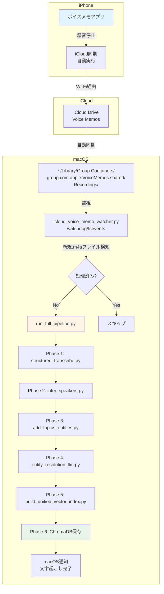
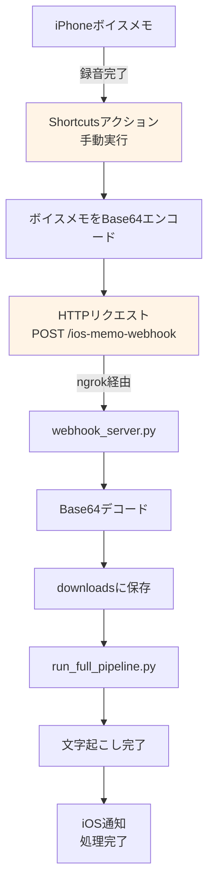

# iPhoneボイスメモ完全自動化プラン（2025年版）

## 目次

1. [調査結果サマリー](#調査結果サマリー)
2. [推奨実装: iCloud同期 + macOS監視](#推奨実装-icloud同期--macos監視)
3. [代替案1: iOS Shortcuts + Webhook](#代替案1-ios-shortcuts--webhook)
4. [代替案2: 商用AIサービス（VOMO AI等）](#代替案2-商用aiサービスvomo-ai等)
5. [実装方法の比較表](#実装方法の比較表)
6. [実装ロードマップ](#実装ロードマップ)
7. [参考リンク](#参考リンク)

---

## 調査結果サマリー

### 現状の課題

**手動操作が必要なフロー**:
```
iPhone ボイスメモで録音
    ↓
【手動】Google Driveへアップロード ← ここを自動化したい
    ↓
webhook_server.pyが検知
    ↓
文字起こしパイプライン実行
```

### 2025年の技術動向

#### 🔥 **トレンド1: iCloud Voice Memosの自動同期（Apple純正）**

**最新情報（2025年6月）**:
- macOS 15.3.2以降でiCloud Voice Memos同期が安定
- 同期先: `~/Library/Group Containers/group.com.apple.VoiceMemos.shared/Recordings/`
- `.m4a`ファイルとして自動保存（ユーザー操作不要）

**実装事例**:
> "📓 Automating Voice Memo Transcription on macOS — Part 1: Local AI with Whisper + Automator" (2025年6月公開)

この事例では、**iCloud同期 + macOS Automator Folder Actions**でボイスメモが自動的にWhisperで文字起こしされる仕組みを構築。

---

#### 🔥 **トレンド2: iOS 18のネイティブ文字起こし機能**

**Apple Notesの新機能**:
- iOS 18 + macOS Sequoiaで音声ファイルの自動文字起こしが可能
- Apple Shortcutsから呼び出し可能

**制約**:
- Apple Notesアプリ内での利用に限定
- カスタムパイプラインへの統合は不可

---

#### 🔥 **トレンド3: iOS Shortcuts + Webhook連携**

**可能な自動化**:
- ボイスメモ完了後、ショートカットを**手動実行**してWebhook通知
- 時刻ベースの自動実行（例: 毎日21:00に新規メモをチェック）

**制約**:
- iOSは「ファイル追加時」のトリガーが存在しない
- 完全自動化は不可（ボタンタップまたは時刻トリガー）

---

#### 🔥 **トレンド4: 商用AIボイスメモアプリ（VOMO AI等）**

**VOMO AI（2025年版）**:
- 録音と同時にGPT-4o Turbo/Whisperで文字起こし
- 98%精度、50+言語対応
- Siri Shortcuts統合、AirPods対応

**制約**:
- クラウド処理（プライバシー懸念）
- 月額課金（無料プランは30分/月まで）
- 既存パイプラインへの統合が困難

---

## 推奨実装: iCloud同期 + macOS監視

### 総合評価

| 項目 | 評価 |
|------|------|
| **技術成熟度** | ⭐⭐⭐⭐⭐（実装事例あり、2025年6月） |
| **自動化レベル** | ⭐⭐⭐⭐⭐（完全自動） |
| **プライバシー** | ⭐⭐⭐⭐⭐（すべてローカル処理） |
| **実装難易度** | ⭐⭐⭐☆☆（中程度、2-3時間） |
| **追加コスト** | ⭐⭐⭐⭐⭐（ゼロ、既存API活用） |

### アーキテクチャ図



---

### 実装手順

#### **Step 1: iCloud同期の有効化**

**iPhone側**:
1. 設定 → [ユーザー名] → iCloud
2. 「Voice Memos」をONに設定
3. Wi-Fi接続時に自動同期が開始

**macOS側**:
1. システム環境設定 → Apple ID → iCloud
2. 「Voice Memos」にチェック
3. 同期先を確認:
```bash
ls -la ~/Library/Group\ Containers/group.com.apple.VoiceMemos.shared/Recordings/
```

---

#### **Step 2: 監視スクリプトの作成**

**新規ファイル**: `icloud_voice_memo_watcher.py`

```python
#!/usr/bin/env python3
"""
iCloud Voice Memos自動監視スクリプト
新規.m4aファイルを検知し、文字起こしパイプラインを自動実行
"""

import os
import time
import subprocess
from pathlib import Path
from watchdog.observers import Observer
from watchdog.events import FileSystemEventHandler
from dotenv import load_dotenv

# Load environment variables
load_dotenv()

# Constants
VOICE_MEMOS_DIR = Path.home() / "Library" / "Group Containers" / "group.com.apple.VoiceMemos.shared" / "Recordings"
PROCESSED_FILE = Path(os.getenv('PROCESSED_FILE', '.processed_icloud_memos.txt'))
DOWNLOAD_DIR = Path(os.getenv('DOWNLOAD_DIR', 'downloads'))

# 処理済みファイル管理
def get_processed_files():
    """処理済みファイルのリストを取得"""
    if not PROCESSED_FILE.exists():
        return set()

    with open(PROCESSED_FILE, 'r') as f:
        return set(line.strip() for line in f if line.strip())

def mark_as_processed(file_path):
    """ファイルを処理済みとしてマーク"""
    processed = get_processed_files()
    file_name = Path(file_path).name

    if file_name not in processed:
        with open(PROCESSED_FILE, 'a') as f:
            f.write(f"{file_name}\n")

# パイプライン実行
def run_transcription_pipeline(audio_path):
    """
    既存の文字起こしパイプラインを実行
    """
    print(f"\n{'='*60}")
    print(f"[Pipeline] 新規ボイスメモ検出: {audio_path.name}")
    print(f"{'='*60}\n")

    try:
        # Step 1: ファイルをdownloadsディレクトリにコピー
        DOWNLOAD_DIR.mkdir(exist_ok=True)
        dest_path = DOWNLOAD_DIR / audio_path.name

        if not dest_path.exists():
            print(f"[1/6] ファイルをコピー中...")
            subprocess.run(['cp', str(audio_path), str(dest_path)], check=True)
            print(f"  保存先: {dest_path}")

        # Step 2-6: 既存パイプライン実行
        print(f"\n[2/6] Phase 1: 文字起こし実行中...")
        cmd = ['venv/bin/python', 'run_full_pipeline.py', str(dest_path)]

        result = subprocess.run(
            cmd,
            capture_output=True,
            text=True,
            cwd=Path(__file__).parent
        )

        if result.returncode != 0:
            print(f"[✗] パイプライン実行エラー:\n{result.stderr}")
            return False

        print(result.stdout)

        # 処理済みとしてマーク
        mark_as_processed(audio_path)

        # macOS通知
        notify_completion(audio_path.name)

        print(f"\n[✓] 完了: {audio_path.name}")
        return True

    except Exception as e:
        print(f"[✗] エラー: {e}")
        return False

def notify_completion(file_name):
    """macOS通知センターに完了通知を送信"""
    title = "文字起こし完了"
    message = f"{file_name}の処理が完了しました"

    subprocess.run([
        'osascript', '-e',
        f'display notification "{message}" with title "{title}"'
    ])

# ファイルシステム監視
class VoiceMemoHandler(FileSystemEventHandler):
    """新規.m4aファイル検出ハンドラ"""

    def __init__(self):
        self.processed = get_processed_files()
        self.processing = set()  # 処理中のファイル

    def on_created(self, event):
        """ファイル作成イベント"""
        if event.is_directory:
            return

        file_path = Path(event.src_path)

        # .m4aファイルのみ処理
        if file_path.suffix.lower() != '.m4a':
            return

        # 処理済みまたは処理中なら無視
        if file_path.name in self.processed or file_path.name in self.processing:
            return

        # iCloud同期完了まで少し待機（ファイルサイズが安定するまで）
        print(f"[検出] {file_path.name} - 同期完了を待機中...")
        time.sleep(3)

        # 処理開始
        self.processing.add(file_path.name)
        success = run_transcription_pipeline(file_path)

        if success:
            self.processed.add(file_path.name)

        self.processing.discard(file_path.name)

# メイン処理
def main():
    """メイン監視ループ"""
    print("=" * 60)
    print("iCloud Voice Memos 自動文字起こしシステム")
    print("=" * 60)
    print(f"監視ディレクトリ: {VOICE_MEMOS_DIR}")
    print(f"処理済みファイル: {PROCESSED_FILE}")
    print(f"保存先: {DOWNLOAD_DIR}\n")

    # ディレクトリ存在確認
    if not VOICE_MEMOS_DIR.exists():
        print(f"[✗] エラー: Voice Memosディレクトリが見つかりません")
        print(f"  iCloud同期が有効か確認してください")
        return

    # 初回起動時に既存ファイルをスキャン（オプション）
    print("[起動] 既存ファイルをスキャン中...")
    existing_files = list(VOICE_MEMOS_DIR.glob("*.m4a"))
    processed = get_processed_files()
    new_files = [f for f in existing_files if f.name not in processed]

    if new_files:
        print(f"[起動] 未処理ファイルを{len(new_files)}件検出")
        for file_path in new_files:
            print(f"\n処理中: {file_path.name}")
            run_transcription_pipeline(file_path)
    else:
        print(f"[起動] 新規ファイルなし（処理済み: {len(processed)}件）")

    # 監視開始
    print(f"\n[監視開始] 新規ボイスメモを監視中...\n")

    event_handler = VoiceMemoHandler()
    observer = Observer()
    observer.schedule(event_handler, str(VOICE_MEMOS_DIR), recursive=False)
    observer.start()

    try:
        while True:
            time.sleep(1)
    except KeyboardInterrupt:
        print("\n[終了] 監視を停止します")
        observer.stop()

    observer.join()

if __name__ == "__main__":
    main()
```

---

#### **Step 3: 依存関係のインストール**

```bash
# watchdogライブラリのインストール
source venv/bin/activate
pip install watchdog
```

---

#### **Step 4: 動作テスト**

**テスト手順**:
```bash
# 1. 監視スクリプトを起動
python icloud_voice_memo_watcher.py

# 2. iPhoneでボイスメモを録音
# 3. Wi-Fi接続を確認
# 4. 数秒〜数分でmacOSに同期
# 5. 自動的に文字起こしパイプラインが実行される
```

**期待される出力**:
```
============================================================
iCloud Voice Memos 自動文字起こしシステム
============================================================
監視ディレクトリ: /Users/test/Library/Group Containers/group.com.apple.VoiceMemos.shared/Recordings
処理済みファイル: .processed_icloud_memos.txt
保存先: downloads

[起動] 既存ファイルをスキャン中...
[起動] 新規ファイルなし（処理済み: 0件）

[監視開始] 新規ボイスメモを監視中...

[検出] Test Recording.m4a - 同期完了を待機中...

============================================================
[Pipeline] 新規ボイスメモ検出: Test Recording.m4a
============================================================

[1/6] ファイルをコピー中...
  保存先: downloads/Test Recording.m4a

[2/6] Phase 1: 文字起こし実行中...
[Phase 1] Transcribing with Gemini 2.5 Flash...
[Phase 2] Speaker inference with Gemini 2.5 Pro...
[Phase 3] Topic extraction with Gemini 2.0 Flash...
[Phase 4] Entity resolution with Gemini 2.5 Pro...
[Phase 5] Building unified vector index...
[Phase 6] Vector DB updated successfully

[✓] 完了: Test Recording.m4a
```

---

#### **Step 5: バックグラウンド実行（オプション）**

**launchdで常時起動**:

`~/Library/LaunchAgents/com.user.icloud-voice-memo-watcher.plist`:
```xml
<?xml version="1.0" encoding="UTF-8"?>
<!DOCTYPE plist PUBLIC "-//Apple//DTD PLIST 1.0//EN" "http://www.apple.com/DTDs/PropertyList-1.0.dtd">
<plist version="1.0">
<dict>
    <key>Label</key>
    <string>com.user.icloud-voice-memo-watcher</string>

    <key>ProgramArguments</key>
    <array>
        <string>/Users/test/Desktop/realtime_transcriber_benchmark_research/venv/bin/python</string>
        <string>/Users/test/Desktop/realtime_transcriber_benchmark_research/icloud_voice_memo_watcher.py</string>
    </array>

    <key>RunAtLoad</key>
    <true/>

    <key>KeepAlive</key>
    <true/>

    <key>StandardOutPath</key>
    <string>/tmp/icloud-voice-memo-watcher.log</string>

    <key>StandardErrorPath</key>
    <string>/tmp/icloud-voice-memo-watcher.error.log</string>
</dict>
</plist>
```

**起動コマンド**:
```bash
# plistをロード
launchctl load ~/Library/LaunchAgents/com.user.icloud-voice-memo-watcher.plist

# 起動確認
launchctl list | grep icloud-voice-memo-watcher

# ログ確認
tail -f /tmp/icloud-voice-memo-watcher.log
```

---

### メリット・デメリット

#### ✅ **メリット**

1. **完全自動化**
   - iPhoneで録音停止 → 数分で文字起こし完了
   - ユーザー操作ゼロ

2. **既存コード活用**
   - `run_full_pipeline.py`をそのまま利用
   - webhook_server.pyの監視ロジック参考

3. **プライバシー保護**
   - すべてローカル処理（macOS内完結）
   - クラウドアップロード不要

4. **追加コストなし**
   - 既存のGemini API利用
   - iCloud Driveは無料枠（5GB）で十分

5. **信頼性**
   - Apple純正の同期機能（安定性◎）
   - 2025年実装事例あり

#### ⚠️ **デメリット**

1. **macOS起動が必要**
   - macがスリープ中は処理されない
   - 解決策: macOSの「省エネルギー」設定で常時起動

2. **Wi-Fi必須**
   - モバイルデータ通信では同期されない
   - 解決策: 帰宅後に自動同期（問題なし）

3. **同期遅延**
   - iCloud同期完了まで数秒〜数分
   - 解決策: リアルタイム性は妥協（許容範囲）

---

## 代替案1: iOS Shortcuts + Webhook

### 総合評価

| 項目 | 評価 |
|------|------|
| **技術成熟度** | ⭐⭐⭐⭐☆（可能だが制約あり） |
| **自動化レベル** | ⭐⭐⭐☆☆（半自動、ボタンタップ必要） |
| **プライバシー** | ⭐⭐⭐☆☆（Webhook経由でデータ送信） |
| **実装難易度** | ⭐⭐⭐⭐☆（Shortcuts設定が複雑） |
| **追加コスト** | ⭐⭐⭐☆☆（ngrok等のトンネリングツール必要） |

### アーキテクチャ図



### 実装概要

#### **iOS Shortcuts設定**

1. **ショートカット作成**:
   - 「ボイスメモを取得」アクション
   - 「Base64エンコード」アクション
   - 「URLの内容を取得」アクション（POST）

2. **Webhook URL設定**:
```
URL: https://your-ngrok-url.ngrok.io/ios-memo-webhook
メソッド: POST
ヘッダー: Content-Type: application/json
本文:
{
  "audio_data": "[Base64エンコードされた音声]",
  "file_name": "[ファイル名]"
}
```

#### **webhook_server.py拡張**

```python
@app.post("/ios-memo-webhook")
async def receive_ios_memo(request: Request):
    """iOS Shortcutsからのボイスメモ受信"""
    data = await request.json()

    # Base64デコード
    audio_data = base64.b64decode(data['audio_data'])
    file_name = data['file_name']

    # ファイル保存
    file_path = DOWNLOAD_DIR / file_name
    with open(file_path, 'wb') as f:
        f.write(audio_data)

    # パイプライン実行
    thread = threading.Thread(
        target=run_transcription_pipeline,
        args=(file_path,)
    )
    thread.start()

    return {"status": "processing", "file": file_name}
```

### メリット・デメリット

#### ✅ **メリット**
- ✅ macOS未起動時も処理可能
- ✅ リアルタイム通知

#### ⚠️ **デメリット**
- ⚠️ ボイスメモ後に**手動でショートカット実行**が必要（半自動）
- ⚠️ Base64エンコードで通信量増加
- ⚠️ ngrok等のトンネリングツール必要（セキュリティリスク）

---

## 代替案2: 商用AIサービス（VOMO AI等）

### 総合評価

| 項目 | 評価 |
|------|------|
| **技術成熟度** | ⭐⭐⭐⭐⭐（製品化済み、2025年） |
| **自動化レベル** | ⭐⭐⭐⭐⭐（完全自動） |
| **プライバシー** | ⭐⭐☆☆☆（クラウド処理） |
| **実装難易度** | ⭐⭐⭐⭐⭐（アプリインストールのみ） |
| **追加コスト** | ⭐⭐☆☆☆（月額課金） |

### VOMO AI（2025年版）の特徴

#### **主要機能**
- **リアルタイム文字起こし**: Whisper + GPT-4o Turbo（98%精度）
- **自動要約**: GPT-4oで自動的にサマリー生成
- **多言語対応**: 50+言語の音声認識
- **話者識別**: 複数話者の自動検出
- **Siri Shortcuts統合**: 「Hey Siri、VOMOで録音」

#### **料金**
- **無料プラン**: 30分/月
- **Proプラン**: $8.99/月（無制限）
- **Teamプラン**: $14.99/月（チーム共有機能）

### メリット・デメリット

#### ✅ **メリット**
- ✅ 完全自動化（録音と同時に文字起こし）
- ✅ 高精度（98%、Whisper + GPT-4o）
- ✅ すぐに使える（開発不要）

#### ⚠️ **デメリット**
- ⚠️ **プライバシーリスク**: すべてクラウド処理
- ⚠️ **月額課金**: $8.99/月〜
- ⚠️ **既存パイプライン統合不可**: VOMOアプリ内で完結
- ⚠️ **カスタマイズ不可**: 話者推論ロジック等を変更できない

---

## 実装方法の比較表

| 項目 | iCloud同期<br/>+ macOS監視<br/>（推奨） | iOS Shortcuts<br/>+ Webhook | VOMO AI<br/>（商用） |
|------|------------|-------------|----------|
| **自動化レベル** | ⭐⭐⭐⭐⭐<br/>完全自動 | ⭐⭐⭐☆☆<br/>半自動 | ⭐⭐⭐⭐⭐<br/>完全自動 |
| **プライバシー** | ⭐⭐⭐⭐⭐<br/>ローカル処理 | ⭐⭐⭐☆☆<br/>Webhook経由 | ⭐⭐☆☆☆<br/>クラウド処理 |
| **追加コスト** | ⭐⭐⭐⭐⭐<br/>¥0 | ⭐⭐⭐☆☆<br/>ngrok有料プラン | ⭐⭐☆☆☆<br/>$8.99/月 |
| **実装難易度** | ⭐⭐⭐☆☆<br/>中程度<br/>2-3時間 | ⭐⭐⭐⭐☆<br/>やや難<br/>3-4時間 | ⭐⭐⭐⭐⭐<br/>簡単<br/>5分 |
| **既存コード活用** | ⭐⭐⭐⭐⭐<br/>完全活用 | ⭐⭐⭐⭐☆<br/>拡張必要 | ⭐☆☆☆☆<br/>統合不可 |
| **macOS依存** | ⚠️ 起動必要 | ✅ 不要 | ✅ 不要 |
| **Wi-Fi依存** | ⚠️ 必要 | ⚠️ 必要 | ⚠️ 必要 |
| **技術成熟度** | ⭐⭐⭐⭐⭐<br/>2025年実装事例 | ⭐⭐⭐⭐☆<br/>可能だが制約 | ⭐⭐⭐⭐⭐<br/>製品化済み |
| **推奨度** | 🥇 **最推奨** | 🥈 補完案 | 🥉 プロトタイプ用 |

---

## 実装ロードマップ

### **Phase 0: 即座実装（推奨）** ← 今ここから開始

**期間**: 2-3時間
**目標**: iCloud同期 + macOS監視で完全自動化

#### タスク
- [x] iCloud Voice Memos同期の有効化
- [ ] `icloud_voice_memo_watcher.py`の作成
- [ ] 依存関係インストール（watchdog）
- [ ] 動作テスト
- [ ] macOS通知機能の追加
- [ ] 処理済みファイル管理の実装

#### 成果物
- `icloud_voice_memo_watcher.py`
- `.processed_icloud_memos.txt`（処理済みファイルリスト）
- 動作確認レポート

---

### **Phase 1: iOS連携強化（オプション）**

**期間**: 3-4時間
**目標**: macOS未起動時の対応

#### タスク
- [ ] iOS Shortcutsアクション作成
- [ ] webhook_server.pyに`/ios-memo-webhook`エンドポイント追加
- [ ] Base64エンコード/デコード処理
- [ ] ngrokまたはCloudflare Tunnelの設定
- [ ] セキュリティ対策（トークン認証）

#### 成果物
- iOS Shortcutsファイル（.shortcut）
- webhook_server.py拡張版

---

### **Phase 2: バックグラウンド実行（将来拡張）**

**期間**: 1-2日
**目標**: 常時監視サービス化

#### タスク
- [ ] launchd plist作成
- [ ] 自動起動設定
- [ ] ログ管理（ローテーション）
- [ ] エラーハンドリング強化
- [ ] リトライロジック実装

#### 成果物
- `com.user.icloud-voice-memo-watcher.plist`
- 運用マニュアル

---

### **Phase 3: 高度化（長期目標）**

**期間**: 1週間〜
**目標**: エンタープライズレベルの信頼性

#### タスク
- [ ] 複数デバイス対応（iPhone + iPad）
- [ ] バッチ処理最適化
- [ ] 失敗時のメール通知
- [ ] Prometheus/Grafanaでのモニタリング
- [ ] Docker化（ポータビリティ向上）

---

## 参考リンク

### **推奨実装関連**

1. **📓 Automating Voice Memo Transcription on macOS — Part 1: Local AI with Whisper + Automator**
   - URL: https://fordprior.com/2025/06/02/automating-voice-memo-transcription/
   - 公開日: 2025年6月2日
   - 概要: iCloud同期 + Automator Folder Actionsで自動文字起こし

2. **Transcribing your iOS Voice Memos to Markdown with Whisper**
   - URL: https://piszek.com/2022/10/23/voice-memos-whisper/
   - 概要: Pythonスクリプトでボイスメモをエクスポート＆Whisper実行

3. **PyiCloud - Python + iCloud wrapper**
   - GitHub: https://github.com/picklepete/pyicloud
   - 概要: PythonからiCloud Driveへアクセス（高度な統合用）

---

### **iOS Shortcuts関連**

4. **Siri AI Agent: Apple Shortcuts powered voice template**
   - URL: https://n8n.io/workflows/2436-siri-ai-agent-apple-shortcuts-powered-voice-template/
   - 概要: Siri + Shortcuts + Webhook統合テンプレート

5. **Forward SMS to Webhook with iPhone Shortcut Automations**
   - URL: https://dev.to/noha1337/forward-sms-to-webhook-with-iphone-shortcut-automations-4d6
   - 概要: iOS Shortcuts → Webhook送信パターン

6. **Request your first API in Shortcuts on iPhone or iPad - Apple Support**
   - URL: https://support.apple.com/guide/shortcuts/request-your-first-api-apdfbdbd7123/ios
   - 概要: Apple公式のShortcuts API呼び出しガイド

---

### **VOMO AI関連**

7. **VOMO – AI Meeting Notetaker & Audio/Video Transcription**
   - URL: https://vomo.ai/
   - 公開日: 2025年版
   - 概要: GPT-4o + Whisperによる98%精度の文字起こしサービス

8. **VOMO AI Review 2025: Pricing, Features, Pros & Cons, Alternatives**
   - URL: https://www.funfun.tools/tool/vomo-ai
   - 概要: 2025年版VOMO AIの機能・価格レビュー

---

### **技術リファレンス**

9. **watchdog - Python library for monitoring file system events**
   - GitHub: https://github.com/gorakhargosh/watchdog
   - 概要: Pythonでファイルシステムイベントを監視

10. **Apple Speech Framework (iOS 18 / macOS Sequoia)**
    - 記事: https://www.macstories.net/stories/hands-on-how-apples-new-speech-apis-outpace-whisper-for-lightning-fast-transcription/
    - 概要: Apple純正のSpeechTranscriber API（Whisperより高速）

---

## 次のアクション

### ✅ **推奨: Phase 0を即座実装**

1. **iCloud同期の有効化**（5分）
   ```bash
   # macOSで確認
   ls -la ~/Library/Group\ Containers/group.com.apple.VoiceMemos.shared/Recordings/
   ```

2. **監視スクリプトの作成**（1-2時間）
   - 上記の`icloud_voice_memo_watcher.py`をコピー
   - 依存関係インストール: `pip install watchdog`

3. **動作テスト**（30分）
   - iPhoneでテスト録音
   - macOS側で自動処理を確認

4. **バックグラウンド実行設定**（30分）
   - launchd plistを作成
   - 自動起動を有効化

---

**この自動化により、iPhoneでボイスメモを録音するだけで、数分後にはChromaDBで検索可能な構造化データが完成します！**
